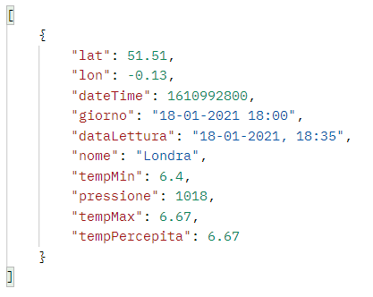
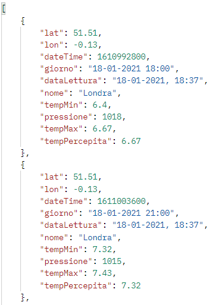
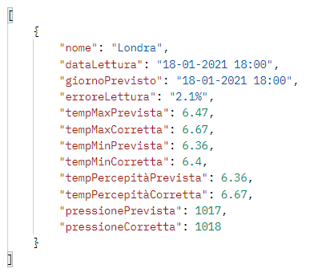

# ProgettoOOP

Lo scopo del progetto è quello di implementare un servizio meteo che fornisca, in base al **Path** scelto, utilizzando i dati forniti dall'**API** di [OpenWeather](https://openweathermap.org/forecast5#geo5):
* Informazioni relative a temperatura e pressione di una determinata città, a partire dalle sue coordinate GPS;
* Statistiche relative alla temperatura massima, minima, percepita e media, in una città su base giornaliera, settimanale e mensile;
* Statistiche relative alla pressione media in una città su base giornaliera, settimanale e mensile;
* Statistiche relative alla quantità di previsione azzeccate in base ad una soglia d'errore.

# FUNZIONAMENTO

L'esecuzione del'servizio avviene tramite **"localhost:8080"** , sfruttando varie Path in base all'oprazione richiesta:

**PARAMETRI**
- *lat*: latitudine;
- *lon*: longitudine;
- *cnt*: intervallo di giorni (da 1 a 5) di cui prendere le previsioni

**NOTA**: i parametri riguardante latitudine e longitudine sono arrotondati per eccesso, alla seconda cifra decimale.

**1)**
Metodo | Path |
---- | ---- |
/ | localhost:8080/ |

mostra latitudine e longitudine di alcune città, tramite una pagina html, quali:
- Ancona: 51.51, -0.13;
- Milano: 45.46, 9.19;
- Londra: 51.51, -0.13;
- Parigi: 48.85, 2.35;
- Berlino: 54.03, 10.45;

**2)**
Metodo | Path | 
---- | ---- | 
GET | localhost:8080/weather?lat={lat}&lon={lon}&cnt={cnt}" | 

fornisce i dati riguardante la città associata a quelle coordinate, per un quantitativo di giorni pari al numero indicato in *cnt* salvandoli, contemporaneamente, all'interno del file "weather.json" il quale funge da storico delle letture;

**Esempio di riposta**

**3)**
Metodo | Path |
---- | ---- |
GET | localhost:8080/update |

effettua una lettura attuale delle previsioni relative ad una serie di città indicate all'interno di un file "city.json"; tale metodo verrà eseguito periodicamente ogni 3 ore.

**Esempio di una parte della risposta**

**4)**
Metodo | Path |
---- | ---- |
GET | localhost:8080/error?lat={lat}&lon={lon}&cnt={cnt}&err={err}

confronta i dati relativi a temperatura e pressione calcolati in precedenza (con un massimo di 5 giorni, deciso dal cnt inserito dall'utente) con quelli presenti attualmente nella città definita dalle coordinate (lat e lon) inserite. Verranno restituiti all'utente solo i dati che hanno un errore totale uguale o inferiore a quello inserito dall'utente (err).

**Esempio di riposta**

